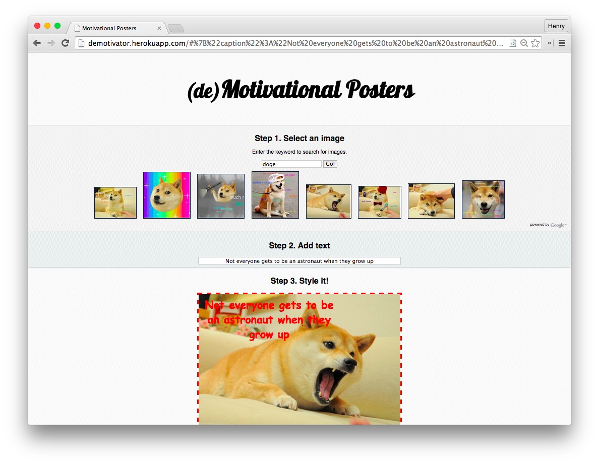

| [*Makers Academy*](http://www.makersacademy.com) | Week 1 |
| ---------------- | ------ |

# The Demotivator

A one day project from my first day at Makers Academy.

A simple Sinatra app. Serves up a single page that lets you find an image from Google Image search, move it into a working area, and add a (hopefully uninspiring) caption to it.

That's it. Nothing fancy.

See it in action [here](http://demotivator.herokuapp.com).

### Technologies

* Ruby
* Sinatra
* JavaScript
* HTML, CSS
* Google Image Search
* Heroku
